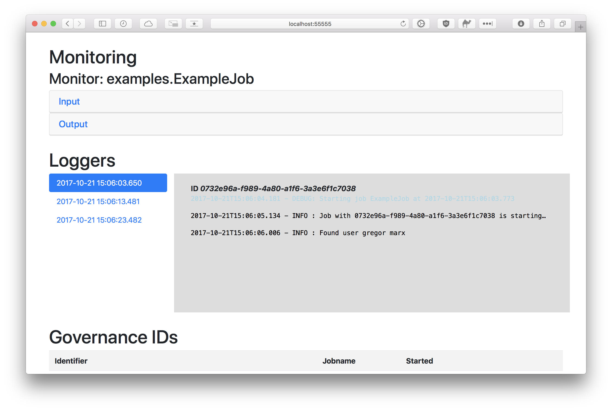

# DataMover

Out of the box scheduling, logging, monitoring and data governance for your scala ETL jobs.


[](https://travis-ci.org/JannikArndt/DataMover)

### Getting DataMover

```xml
<dependency>
  <groupId>de.jannikarndt</groupId>
  <artifactId>datamover_2.12</artifactId>
  <version>1.2.0</version>
</dependency>
```

or

```sbtshell
libraryDependencies += "de.jannikarndt" % "datamover" % "1.1.0"
```

### Example:

```scala
import de.jannikarndt.datamover._
import de.jannikarndt.datamover.governance.GovernedID
import scala.concurrent.duration._
import scala.language.postfixOps

object ExampleJob {
    def main(args: Array[String]): Unit = DataMover run classOf[ExampleJob] every (10 seconds)
}

class ExampleJob extends DataMover("ExampleJob") {

    override def run(): Unit = {
        // here you can access
        // - logger => Log debug, info or error information
        // - monitor => track throughput
        // - governedId => append this to your output to find the job that generated it

        // Logging
        logger.info(s"Logs are aggregated per run. These are for Job ${governedId.identifier}.")

        // Write you own EXTRACT-function

        // Monitor your input
        monitor.input(5)
        
        // Write your own TRANSFORM-function

        // Write your own LOAD-function
        
        // Monitor your output
        monitor.output("Appended successfully")
    }
}
```

Then head to [http://localhost:55555](http://localhost:55555) (and increasing for every additional job):



### Monitoring with Prometheus

[Prometheus](https://prometheus.io/download/) can read directly from DataMover jobs. Just add the `targets: ['localhost:55555']` to your `prometheus.yml`!

### License

This code is open source software licensed under the [MIT License](LICENSE).

### To-Do / Planned

- Data Governance
- Alerting when job fails
- Uptime-Monitoring for sources and sinks

- Versioning: Which version of which job is deployed where? + Changelog
- Feature toggles

- Central server to monitor all jobs:


- Interface for Elastic/Kibana
- Interface for Jolokia

### Deployment

Snapshots are deployed at [oss.sonatype.org](https://oss.sonatype.org/content/repositories/snapshots/de/jannikarndt/datamover_2.12/).
Releases are deployed at [maven.org](https://repo1.maven.org/maven2/de/jannikarndt/datamover_2.12/).

### Changes

#### v1.3.0
- Support for Prometheus
- Jobs automatically choose a free port, starting at 55555
- LogLevel coloring
- GovernedId can be accessed anywhere in class

#### v1.2.0
- Logger now supports ERROR, WARN and DEBUG
- Governor writes valid json
- artifact id contains scala version

#### v1.1.0
- Upgrade to scala 2.12.3
- Removed unnecessary dependencies
- Removed old files