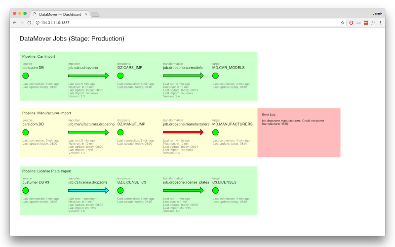

# DataMover

Out of the box scheduling, logging, monitoring and data governance.

[](https://travis-ci.org/JannikArndt/DataMover)

### Getting DataMover

```xml
<dependency>
  <groupId>de.jannikarndt</groupId>
  <artifactId>datamover</artifactId>
  <version>1.1.0</version>
</dependency>
```

### Example:

```scala
import de.jannikarndt.datamover._
import scala.concurrent.duration._
import scala.language.postfixOps

object ExampleJob {
    def main(args: Array[String]): Unit = DataMover run classOf[ExampleJob] every (10 seconds)
}

class ExampleJob extends DataMover("ExampleJob") {

    override def run(): Unit = {
    
        // Logging
        logger.info("Logs are aggregated per run")

        // Write you own EXTRACT-function

        // Monitor your input
        monitor.input(5)
        
        // Write your own TRANSFORM-function

        // Write your own LOAD-function
        
        // Monitor your output
        monitor.output("Appended successfully")
    }
}
```

### License

This code is open source software licensed under the [MIT License](LICENSE).

### To-Do / Planned

- Data Governance
- Alerting when job fails
- Uptime-Monitoring for sources and sinks

- Versioning: Which version of which job is deployed where? + Changelog
- Feature toggles

- Central server to monitor all jobs:


- Interface for Prometheus/Grafana
- Interface for Elastic/Kibana
- Interface for Jolokia

### Deploy to Sonatype

#### Snapshot
Run 

```bash
mvn clean deploy
```

Snapshots are deployed at [oss.sonatype.org](https://oss.sonatype.org/content/repositories/snapshots/de/jannikarndt/datamover/).

#### Release

Removed the `-SNAPSHOT` from the version in `pom.xml` and run

```bash
mvn clean package source:jar gpg:sign install:install deploy:deploy
```

and then head to [sonatype.org](https://oss.sonatype.org/#stagingRepositories), `Close` the repository and `Release` it.

Releases are deployed at [maven.org](https://repo1.maven.org/maven2/de/jannikarndt/datamover/).

### Changes

#### v1.1.0
- Upgrade to scala 2.12.3
- Removed unnecessary dependencies
- Removed old files